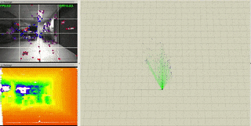
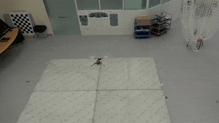

#  FLVIS
## Feedback Loop Based Visual Inertial SLAM

## Original repository
This repository is a modified version of [FLVIS](https://github.com/HKPolyU-UAV/FLVIS) (see original README below). We facilitate the installation process and the use of Docker.

## Docker support

In order to facilitate the installation process, the system is wrapped up using Docker.
We provide scripts to create a Docker image, build the system and run it in a Docker container. 

### Dependencies 
* Docker
* ROS
* [`pose_listener`](https://github.com/CIFASIS/pose_listener) (if you use `run_rosario_sequence.sh`, see below)

### Building the system
Run:
```
./run.sh -b
```

This command creates a Docker image, installs all the dependencies and builds the system. The resulting image contains a version of the system ready to be run.

### Running the system in VIS mode
If you are not interested in making changes in the source code, you should run the system in VIS mode. Run:
```
./run.sh -v
```
The system is launched in a Docker container based on the previously built image. By default, this command executes a launch file which is configured to run the Rosario dataset. If you want to run your own dataset, **write a launch file and placed it in the `launch/` folder**. Then, run the script with the option `-l <LAUNCH_FILE_NAME>`. For example, if you are testing EuRoC, write `euroc_dataset.launch`, move it into `launch/` and type:
```
./run.sh -v -l euroc_dataset.launch
```
Making changes in launch files in the host is possible because `launch/` folder is mounted into the Docker container. It is not necessary to access the container through a bash shell to modify these files.

See below for information about input data and visualization.

### Running the system in DEV mode
DEV mode allows developers to make changes in the source code, recompile the system and run it with the modifications. To do this, the whole repository is mounted in a container. Run:
```
./run.sh -d
```
This opens a bash shell in a docker container. You can edit source files in the host and after that you can use this shell to recompile the system. When the compilation process finishes, you can run the method using `roslaunch`.

See below for information about input data and visualization.

### Input data and visualization

At this point, the system is waiting for input data. Either you can run `rosbag play` or you can use `run_rosario_sequence.sh`.
If you choose the latter, open a second terminal and run:
```
./run_rosario_sequence.sh -o <OUTPUT_TRAJECTORY_FILE> <ROSBAG_FILE>
```
In contrast to what `run.sh` does, `run_rosario_sequence.sh` executes commands in the host (you can modify it to use a Docker container). 

`ROSBAG_FILE` is played using `rosbag`. Also, make sure you have cloned and built `pose_listener` in your catkin workspace. Default path for the workspace is `${HOME}/catkin_ws`, set `CATKIN_WS_DIR` if the workspace is somewhere else (e.g.: `export CATKIN_WS_DIR=$HOME/foo_catkin_ws`). `pose_listener` saves the estimated trajectory in `<OUTPUT_TRAJECTORY_FILE>` (use absolute path). You can edit `run_rosario_sequence.sh` if you prefer to save the trajectory using your own methods. Additionally, `run_rosario_sequence.sh` launches `rviz` to display visual information during the execution of the system.

Alternatively, if you are not interested in development but in testing or visualization, instead of running `run.sh` and `run_rosario_sequence.sh` in two different terminals, you can just run:
```
./run_rosario_sequence.sh -r -o <OUTPUT_TRAJECTORY_FILE> <ROSBAG_FILE>
```
This launches a Docker container and executes the default launch file (see `LAUNCH_FILE` in `run.sh`). After that, the bagfile is played and `rviz` and `pose_listener` are launched. Add `-b` if you want to turn off the visualization.


# Original README

### 1-Video
<a href="https://www.youtube.com/embed/ljZWb2x6CRQ" target="_blank"></a>

| EuRoC DataSet MH_05    | Handheld Test in Lab   | FlVIS on UAV Platform  |
| ---------------------- | ---------------------- |---------------------- |
|   |   |   |

### 2-Relevent Publication:
Under Review, a pre-print version can be found [here](https://arxiv.org/abs/2007.02250)
### 3-Support Hardware/Dataset:
Intel RealSense D435i Camera <br />
EuRoC MAV Dataset
### 4-Build The Project
We have tested in the following environment: <br />
Ubuntu 16.04 + ROS Kinetic <br />
Ubuntu 18.04 + ROS melodic <br />
Clone the repository to the catkin work space eg. /catkin_ws/src
````
git clone https://github.com/Ttoto/FLVIS.git
````
Install 3rd Part library
````
cd catkin_ws/src/FLVIS/3rdPartLib/
./install3rdPartLib.sh
````
Compile
````
cd ~/catkin_ws
catkin_make
````
### 5-Verification
#### 5.1 D435i Camera Depth Mode
##### 5.1.1 Use our recorded rosbag 
Download the dataset [Link-melab_sn943222072828.bag](https://drive.google.com/file/d/1kfOkQTt-i-Hd2M0FZa8Dia4_BweE-ttf/view?usp=sharing) to /bag folder <br />
Decompress the rosbag:
````
rosbag decompress melab_sn943222072828.bag
````
run the following launch files:
````
roslaunch flvis rviz.launch
roslaunch flvis flvis_bag.launch
````
##### 5.1.2 Use your own camera:
Install the [realsense driver](https://github.com/IntelRealSense/librealsense) and its [ros wrapper](https://github.com/IntelRealSense/realsense-ros) <br />
Boot the d435i camera and echo the camera infomation
````
roslaunch flvis d435i_depth.launch
rostopic echo /camera/infra1/camera_info
````
You will get the camera infomation like:

As shown, where the resolution is 640x480 and fx=384.16455078125; fy=384.16455078125; cx=320.2144470214844;cy=238.94403076171875. <br />
Edit these information in the config yaml file (say: /launch/d435i/sn943222072828_depth.yaml):
```yaml
image_width: 640
image_height: 480
cam0_intrinsics: [384.16455078125, 384.16455078125, 320.2144470214844, 238.94403076171875]#fx fy cx cy
cam0_distortion_coeffs: [0.0, 0.0, 0.0, 0.0]#k1 k2 r1 r2
```
In the launch file "flvis_d435i.launch", make sure "/yamlconfigfile" is point to the edited config file
````
<param name="/yamlconfigfile" type="string" value="$(find flvis)/launch/d435i/sn943222072828_depth.yaml"/>
````
run the following launch files:
````
roslaunch flvis rviz.launch
roslaunch flvis flvis_d435i_depth.launch
````
#### 5.2 D435i Camera Stero Mode
Like what we did in 5.1.2, we need to config the sn943222072828_stereo.yaml <br />
Note that, by default the two camera share the same intrinsic parameters, and the baseline length is 0.05m:
```yaml
cam0_intrinsics: [384.16455078125, 384.16455078125, 320.2144470214844, 238.94403076171875]#fx fy cx cy
cam0_distortion_coeffs: [0.0, 0.0, 0.0, 0.0]#k1 k2 r1 r2
cam1_intrinsics: [384.16455078125, 384.16455078125, 320.2144470214844, 238.94403076171875]#fx fy cx cy
cam1_distortion_coeffs: [0.0, 0.0, 0.0, 0.0]#k1 k2 r1 r2
T_cam0_cam1:
[ 1.0,  0.0,  0.0,  0.05,
  0.0,  1.0,  0.0,  0.0,
  0.0,  0.0,  1.0,  0.0,
  0.0,  0.0,  0.0,  1.0]

```

#### 5.3 EuRoC MAV Dataset
Download the dataset(say MH_05_difficult) into the bag folder:
````
roscd flvis/bag/
wget http://robotics.ethz.ch/~asl-datasets/ijrr_euroc_mav_dataset/machine_hall/MH_05_difficult/MH_05_difficult.bag
````
Edit the corresponding bag name in flvis_euroc_mav.launch file:
````
<node pkg="rosbag" type="play" name="rosbag" args="$(find flvis)/bag/MH_05_difficult.bag"/>
````
run the following launch files:
````
roslaunch flvis rviz.launch
roslaunch flvis flvis_euroc_mav.launch
````


### Maintainer:
[Shengyang Chen](https://www.polyu.edu.hk/researchgrp/cywen/index.php/en/people/researchstudent.html)(Dept.ME,PolyU): shengyang.chen@connect.polyu.hk <br />
Yajing Zou(Dept.LSGI,PolyU):rick.zou@connect.polyu.hk

